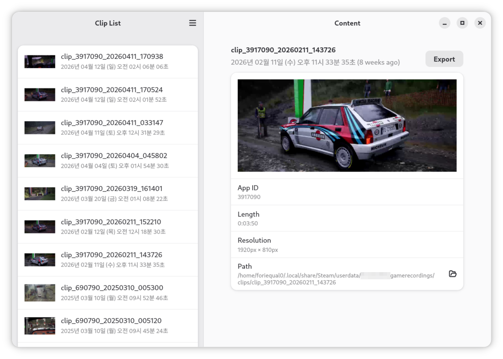

Steam Clip Exporter
===



### Motivation

Steam has a feature called 'Game Recording'.
It's a neat feature. You can record clips of your gameplay (automatically or manually with a shortcut) and export them to a file.

But there are some issues for Linux users:

1. You can't export a clip to H265 encoding ([#11849](https://github.com/ValveSoftware/steam-for-linux/issues/11849))
2. It takes a long time to re-encode a clip when you export it to H264 encoding even if it is encoded in H264 in the first place.

This tool is a workaround for these issues.

### How to build

#### Prerequisites

1. [Rust compiler](https://rustup.rs/)
2. [gtk-rs development libraries](https://gtk-rs.org/gtk4-rs/stable/latest/book/installation_linux.html)
3. `cvlc` (for debian/ubuntu, it's in `vlc-bin` package)

### Build and run

```bash
git clone https://github.com/foriequal0/steam-clip-exporter.git
cd steam-clip-exporter
cargo run
```

### TODO

* [ ] export progress bar or spinner
* [ ] show game title instead of app id
* [ ] configurations (steam root, window size, etc)
* [ ] remove vlc dependency?
* [ ] handle more cases
  * [ ] background recording
  * [ ] unknown fields
* [ ] packaging 
  * [ ] deb
  * [ ] flatpak
